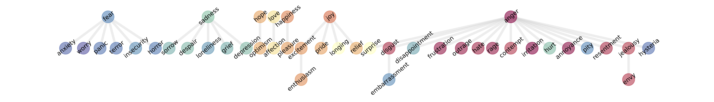
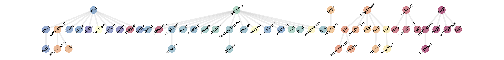
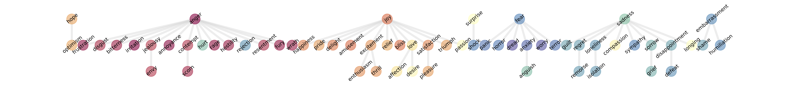

## Supplementary Visual Results
This page provides additional qualitative figures referenced in the author response.

### Overview
1. The clustering pipeline remains coherent on a public human-labeled text corpus.
2. Similar structure appears in a separate reasoning-oriented model family.
3. The grouping pattern remains qualitatively stable when the extraction instruction is rephrased.

---

### 1. Public Human-Labeled Corpus
**Takeaway:** The procedure still recovers coherent structure on a real-world labeled dataset.

<b>(a) Smaller base model</b> 

  

<b>(b) Larger base model</b> 

Across both scales, related affective categories continue to group together. The larger model yields a deeper and more fine-grained hierarchy than the smaller one.

---

### 2. Transfer to a Different Model Family
**Takeaway:** The same pipeline transfers to a reasoning-oriented family outside the main set of base-model experiments.

<b>(a) Larger reasoning-oriented variant</b> 

  

<b>(b) Smaller reasoning-oriented variant</b> 

Both variants recover meaningful structure, indicating that the effect is not tied to a single model family.

---

### 3. Robustness to Instruction Wording
**Takeaway:** The recovered hierarchy remains qualitatively similar when the extraction instruction is rephrased.

<b>(a) Smaller base model under alternate wording</b> 

  

<b>(b) Larger base model under alternate wording</b> 

The main groupings remain stable under the wording change, especially for the larger model.
