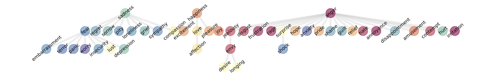
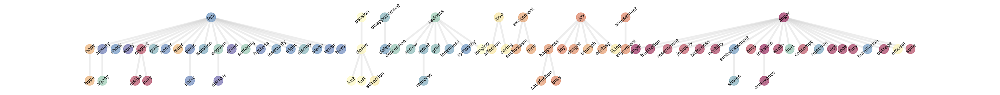
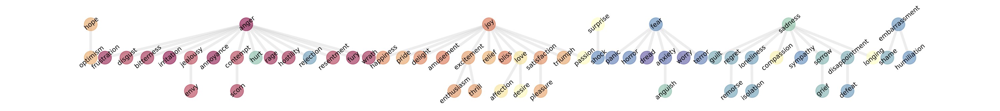

### Fig. S1. Real-World Human-Annotated Data (GoEmotions)

<b>(a) Llama 8B</b> 

  

<b>(b) Llama 70B</b> 

**Fig. S1.** The hierarchy-construction procedure continues to recover coherent emotion structure on real-world human-annotated data. Shown are hierarchies of emotions in Llama models using the GoEmotions dataset. Each node corresponds to an emotion and is colored according to groups of related emotions (as defined by the emotion wheel in Fig. 1a). The larger model, Llama 70B (b), produces deeper and more fine-grained hierarchies than the smaller Llama 8B (a), reflecting its greater representational capacity.

---

### Fig. S2. Generalization to Reasoning Models (DeepSeek-R1)
<b>(a) DeepSeek-R1 reasoning model (70B)</b> 

  

<b>(b) DeepSeek-R1 reasoning model (32B)</b> 

**Fig. S2.** The same procedure also recovers meaningful emotion hierarchies on **DeepSeek-R1** reasoning models, indicating that the effect is not limited to the original model family. Shown are hierarchies of emotions in two **DeepSeek-R1** reasoning models, extracted using 5000 situational prompts generated by GPT-4o. Each node represents an emotion and is colored according to groups of emotions known to be related (the emotion wheel in Fig. 1a). These models are publicly released DeepSeek-R1 distilled variants.

---

### Fig. S3. Robustness to Prompting
<b>(a) Llama 8B</b> 

  

<b>(b) Llama 70B</b> 

**Fig. S3.** The recovered hierarchies remain qualitatively stable even when the extraction prompt wording is changed. We compare emotion trees produced when the instruction is changed from `the emotion in this sentence is` to `the sentiment in this sentence is`. Across both models, similar emotions consistently cluster together, indicating robustness to prompt wording. The larger model, Llama 70B (b), produces deeper and more fine-grained hierarchies than the smaller Llama 8B (a), reflecting its greater representational capacity.
