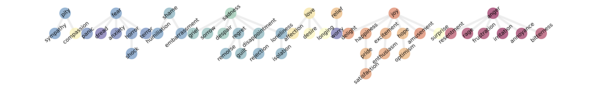

## Additional Experimental Results (Rebuttal)
This section provides additional empirical evidence to address the reviewers' inquiries regarding model generalizability, robustness, and real-world dataset validity.

---

### GoEmotions Dataset
We replicated our experiments using real-world human-annotated dataset: [GoEmotions Dataset](https://github.com/google-research/google-research/tree/master/goemotions) (Demszky et al., 2020).

<b>(a) Llama 8B</b> 

  

<b>(b) Llama 70B</b> 

Hierarchies of emotions in Llama models using the GoEmotions dataset. Each node corresponds to an emotion and is colored according to groups of related emotions (as defined by the emotion wheel in Fig. 1a). The larger model, Llama 70B (b), produces deeper and more fine-grained hierarchies than the smaller Llama 8B (a), reflecting its greater representational capacity.

---

### Generalizability Across Model Architectures

To verify that hierarchical emotion emergence is not architecture-specific (Llama/GPT), we extend our analysis to reasoning models, specifically **DeepSeek-R1** distilled variants. 

<b>(a) DeepSeek-R1</b> (Llama 70B distilled variant) 

  

<b>(b) DeepSeek-R1</b> (Qwen 32B distilled variant) 

Hierarchies of emotions in two variants of DeepSeek-R1 models are extracted using 5000 situational prompts generated by GPT-4o.  
Each node represents an emotion and is colored according to groups of emotions known to be related (the emotion wheel in Fig. 1a).

---

### Sensitivity to Prompting Strategies
We addressed the concern regarding lexical sensitivity by comparing the stability of hierarchies when the core instruction is varied.

<b>(a) Llama 8B</b> 

  

<b>(b) Llama 70B</b> 

Sensitivity to prompting in hierarchical emotion clustering. We compare emotion trees produced when the instruction is changed from `the emotion in this sentence is` to `the sentiment in this sentence is.`
Across both models, similar emotions consistently cluster together, indicating robustness to prompt wording. The larger model, Llama 70B (b), produces deeper and more fine-grained hierarchies than the smaller Llama 8B (a), reflecting its greater representational capacity.

